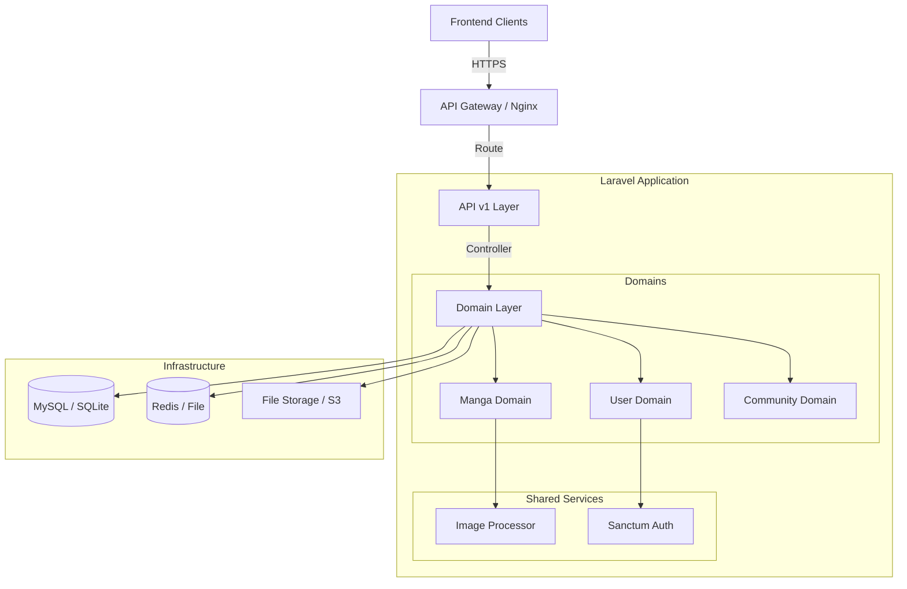

# System Architecture

## 📐 High-Level Design
The Manga Reader API is a decoupled backend service designed to serve multiple frontend clients (Web, Mobile).

## 🧩 Domain Boundaries

### 1. Manga Domain
- **Core Entities**: `MangaSeries`, `Chapter`, `ChapterImage`, `Genre`, `Author`.
- **Responsibilities**: Metadata management, chapter uploads, search indexing, and content approval.

### 2. User Domain
- **Core Entities**: `User`, `Follow`, `ReadingHistory`.
- **Responsibilities**: Authentication, profile management, following/bookmarking manga, and tracking reading progress.

### 3. Community Domain
- **Core Entities**: `Comment`, `Rating`.
- **Responsibilities**: Social interactions, feedback loops, and content rating.

## 🔐 Authentication & Authorization
- **Auth**: Laravel Sanctum provides stateful authentication for SPAs and token-based authentication for mobile apps.
- **Roles/Permissions**: Powered by `spatie/laravel-permission`.
    - `Admin`: Full access to manga management and moderation.
    - `User`: Access to profiles, following, and community features.
    - `Guest`: Read-only access to public manga data.
- **Middleware**: Custom `EnsureUserHasRole` middleware (aliased as `role`) enforces RBAC on sensitive routes.

## 🔄 Request/Response Lifecycle
1.  **Request**: Client sends a request (e.g., `GET /api/v1/manga/one-piece`).
2.  **Routing**: `apiroute` directs request to `MangaController@show`.
3.  **Validation**: `FormRequest` validates input and sanitizes data (e.g., whitelisting URL protocols for images).
4.  **Domain Call**: Controller calls `MangaService` or `MangaSeries::whereSlug(...)`.
5.  **Transformation**: Controller wraps the result in `MangaResource`.
6.  **Response**: `ApiResponse` trait formats the JSON and returns it with appropriate headers and status code.

## 📡 API v1 Endpoints (Manga Domain)

### Manga Series
- `GET /api/v1/manga`: List all manga with filtering and sorting.
- `GET /api/v1/manga/{slug}`: Get detailed information for a single manga.
- `GET /api/v1/manga/search?keyword=...`: Search manga by title or alternative titles (optimized JSON search).
- `POST /api/v1/manga`: Create new manga (Admin only).
- `PUT /api/v1/manga/{slug}`: Update manga details (Admin only).
- `DELETE /api/v1/manga/{slug}`: Soft delete manga (Admin only).

### Chapters
- `GET /api/v1/manga/{slug}/chapters`: List chapters for a manga.
- `GET /api/v1/manga/{slug}/chapters/{number}`: Get chapter content with images.
- `POST /api/v1/manga/{slug}/chapters`: Create new chapter (Admin only).
- `PUT /api/v1/manga/{slug}/chapters/{number}`: Update chapter (Admin only).
- `DELETE /api/v1/manga/{slug}/chapters/{number}`: Delete chapter (Admin only).
- `GET /api/v1/chapters/pending`: List chapters awaiting approval (Admin only).
- `POST /api/v1/chapters/{id}/approve`: Approve a pending chapter (Admin only).

### Supporting Resources
- `GET /api/v1/genres`: List all available genres.
- `GET /api/v1/genres/{slug}`: List manga belonging to a specific genre.
- `GET /api/v1/authors`: List all authors.
- `GET /api/v1/authors/{slug}`: List manga written/illustrated by a specific author.

## 📊 Database Schema Overview
- **Relational Integrity**: Foreign keys are used across all tables to ensure data consistency.
- **Performance**: Indexes are applied to `slug`, `email`, and searchable fields in `manga_series`.
- **JSON Search**: Alternative titles stored in JSON column are searchable via parameterized `JSON_SEARCH`.
- **Scalability**: Pivot tables handle many-to-many relationships (e.g., `author_manga_series`).

## ❓ Unresolved Questions
- Will we need a separate microservice for image processing if traffic increases significantly?
- Should we implement ElasticSearch/Meilisearch for manga searching or stick with SQL `LIKE` and full-text indexes for now?
